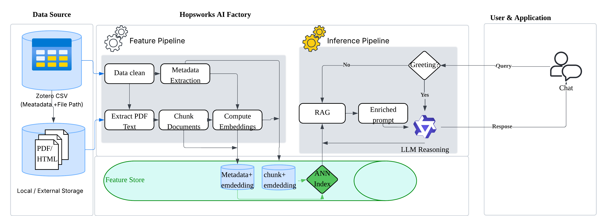

# ID2223-Project  
## Qwen-8B Research Agent with Zotero-Driven RAG

## 📚 Introduction

This project implements an intelligent **Paper Reading Agent** that goes beyond simple chatbots by using an **autonomous agentic loop**. It uses **Hopsworks Feature Store** to manage vector embeddings created from **Zotero** libraries. Unlike static `Query → Retrieve → Answer` pipelines, this agent actively **checks if the evidence is sufficient**. It uses a **two-stage retrieval strategy** (first checking metadata, then searching full text with **reranking**) to decide whether to search more or answer the question based on the quality of the context. This retrieved evidence forms the basis of **In-Context Learning (ICL)**—aided by few-shot examples—allowing the LLM to generate accurate answers with **strict, evidence-backed citations**.

The system allows users to interact with their research papers as a searchable knowledge base, making it easier to explore literature, understand concepts, and reason across multiple papers.

## 🏗️ System Architecture

## 🔄 Pipelines Description

The project is built around three core pipelines designed to handle data loading, updates, and the agent itself. These pipelines are modular, keeping data processing (MLOps) separate from the application logic.

### 1. Feature Backfill Pipeline (Bootstrap)

The Feature Backfill pipeline is responsible for building the **initial knowledge base**.
It performs the following steps:
- **Data Ingestion**: Loads paper metadata and extracts full text from PDFs based on the Zotero export.
- **Feature Engineering**: Processes data in two streams—**metadata** (Titles/Abstracts) is embedded directly, while **full text** is first split into chunks before embedding. The embedding model used is **all-MiniLM-L6-v2**.
- **Storage**: Uploads both raw data and vector embeddings to **Hopsworks Feature Store**, organizing them into separate groups for metadata and chunks.

This pipeline is run once to set up the system with your complete literature collection.

---

### 2. Feature Pipeline (Incremental Update)

The Feature Pipeline handles **continuous learning** by processing updates.
It focuses on:
- **Change Detection**: Finds new or modified entries in the Zotero CSV by comparing it with the existing Feature Store.
- **Update Logic**: Applies the **same processing steps** (chunking and embedding) as the backfill pipeline to the new data.
- **Synchronization**: Updates the existing Hopsworks Feature Groups with the new metadata and vectors.

This design allows for efficient updates as your literature collection grows.

---

### 3. Inference Pipeline (Agent & UI)

The Inference Pipeline runs the **Paper Reading Agent** and provides the interface for the user.

- **Agent Setup**: Creates the runtime agent by connecting to the Hopsworks vector database and setting up the reasoning modules (Intent Router, Context Builder) to support RAG and In-Context Learning.
- **User Interface (UI)**: Deploys a **chatbot-style interface** where the model generates answers with strict **paper-level citations**. Users can click on **collapsible icons** to view the specific full-text chunks used as evidence.

Together, these components turn static data in Hopsworks into a dynamic research assistant.

## 🧠 Agent Execution Model

After setup, the agent follows a **stateful, retrieval-driven model**. It uses a **"Coarse-to-Fine" Agentic Loop** that manages intent routing, multi-stage retrieval via **MCP**, and precise reranking before generating an answer. Here, we use Qwen-8B LLM.

The execution logic consists of four phases:

### 1. Intent Routing (RAG Trigger)

The **Intent Router** first checks the user query to decide what to do:
- **Direct Interaction**: General chat is handled immediately without searching the database.
- **RAG Activation**: Research questions trigger the agent loop, starting the multi-stage interaction with the **Hopsworks Feature Store**.

### 2. Phase I: Semantic Scoping (Metadata Search)

When entering the loop, the agent performs a broad search to limit the scope:
- **Vector Search**: Uses Hopsworks' **`find_neighbors`** method to search **metadata embeddings** (Titles/Abstracts).
- **Metric**: Uses **Cosine Similarity** to find the top-k most relevant papers.
- **Silent Filtering**: The found `paper_ids` are used only to filter the next step and are **not** shown to the LLM.

### 3. Phase II: Deep Retrieval & Cross-Encoder Reranking

Immediately after finding the relevant papers, the system performs a **Deep Search** to get detailed evidence:
- **Chunk Retrieval**: Runs a second `find_neighbors` search (Cosine Similarity) for **full-text chunk embeddings**, searching only within the candidate `paper_ids` found in Phase I.
- **Cross-Encoder Reranking**: The retrieved chunks are passed to the rerank model **ms-marco-MiniLM-L-6-v2**. This model re-scores the pairs of (Query, Chunk) to catch complex meanings that simple similarity might miss.
- **Context Injection**: The top-ranked chunks are added to the agent's state, and the loop continues to refresh the context.

### 4. Phase III: Grounded Generation (ICL + Prompt)

In the final phase, the agent generates the answer using the optimized context:
- **Dynamic Context Assembly**: The **Context Builder** creates the system prompt using the reranked full-text chunks.
- **In-Context Learning (ICL)**: The prompt is improved with **few-shot examples** to guide the LLM’s style and citation format.
- **Evidence-Based Answer**: The LLM creates an answer using *only* the provided context, adding strict **Paper-Level Citations** (e.g., `[1]`) that link back to the source documents.

### 🧪 User Interaction Examples

The following table demonstrates how the agent decides to access the PCG knowledge base based on user intent.

| User Query | Intent Classification | System Decision / Action |
| :--- | :--- | :--- |
| **"Hello, who are you?"** | `Direct Interaction` | **No Retrieval**. The LLM answers directly using internal instructions regarding its role as an assistant. |
| **"How is the Diffusion Model applied to PCG signal synthesis?"** | `RAG Search` | **Full RAG Loop**. Scopes with Metadata $\to$ Drills down into Chunks $\to$ Reranks $\to$ Generates Answer. |
| **"What metrics are used to evaluate the quality of synthetic heart sounds?"** | `RAG Search` | **Full RAG Loop**. Scopes with Metadata $\to$ Drills down into Chunks $\to$ Reranks $\to$ Generates Answer. |

## 📈 Analysis & Future Roadmap

* **Advanced Content Parsing**: Currently, the pipeline treats PDFs as flat text streams, often mixing headers and captions with main content. Future iterations will adopt **Layout-Aware Parsing** to semantically distinguish text, images, and tables for higher-quality retrieval contexts.

* **Hybrid Search with Metadata**: The system currently uses metadata only for embedding and lacks deterministic filtering capabilities. We plan to implement **SQL-like Pre-filtering** to allow strict constraints (e.g., "Papers published after 2023") alongside semantic search.

* **Ensemble Retrieval Strategies**: Relying solely on vector similarity can miss exact keyword matches for specific PCG acronyms. Future work will integrate **Sparse Retrieval (BM25)** with vector search to balance semantic understanding with precise keyword matching.
